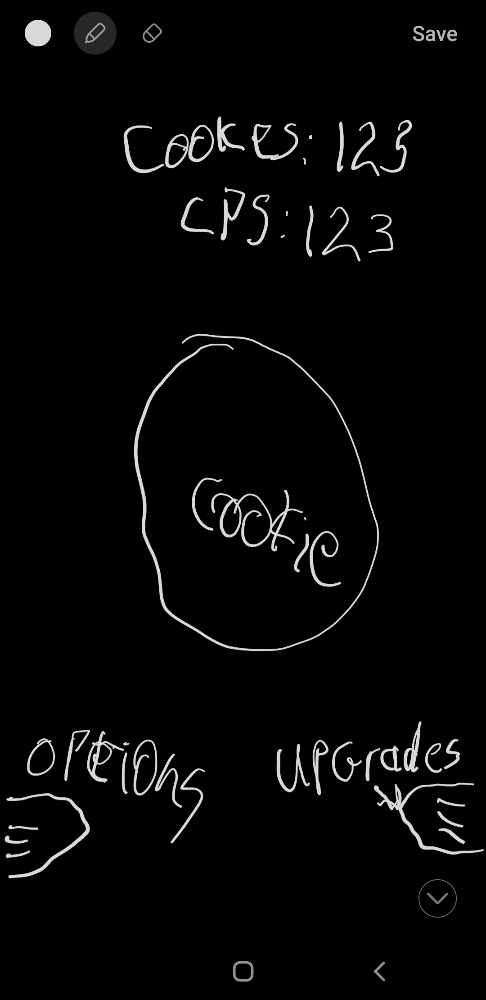
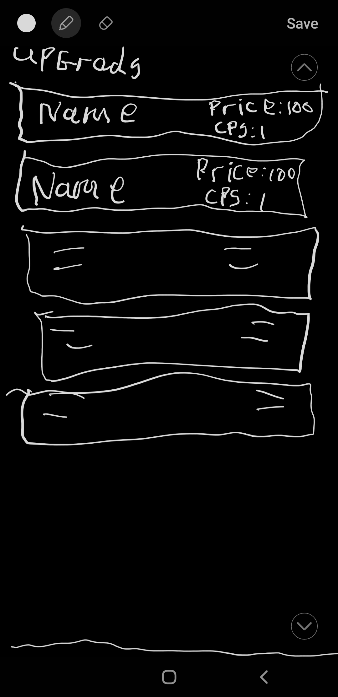

# week 3 assingment

## Reflection

  

- basic requirements

  - API call done ease
  - shop upgrade done ease
  - functions effectively done ease
  - website respond (phone) done not so ease
  - website respond (pc) done it was a pain
  - local storage done ease
  - cookie count / automations done ease
  - game state done ease

- stretch goals
  - single function done ease
  - handle errors done ease
  - add sound with volume control done
  -

## References

- i was haveing a hard time geting the visibility button to work the way i wont them to im still not happy with them.
- cookie image from google
- sound file i made
- phone layout done on my phone
- i use okso.app to help make a layout
